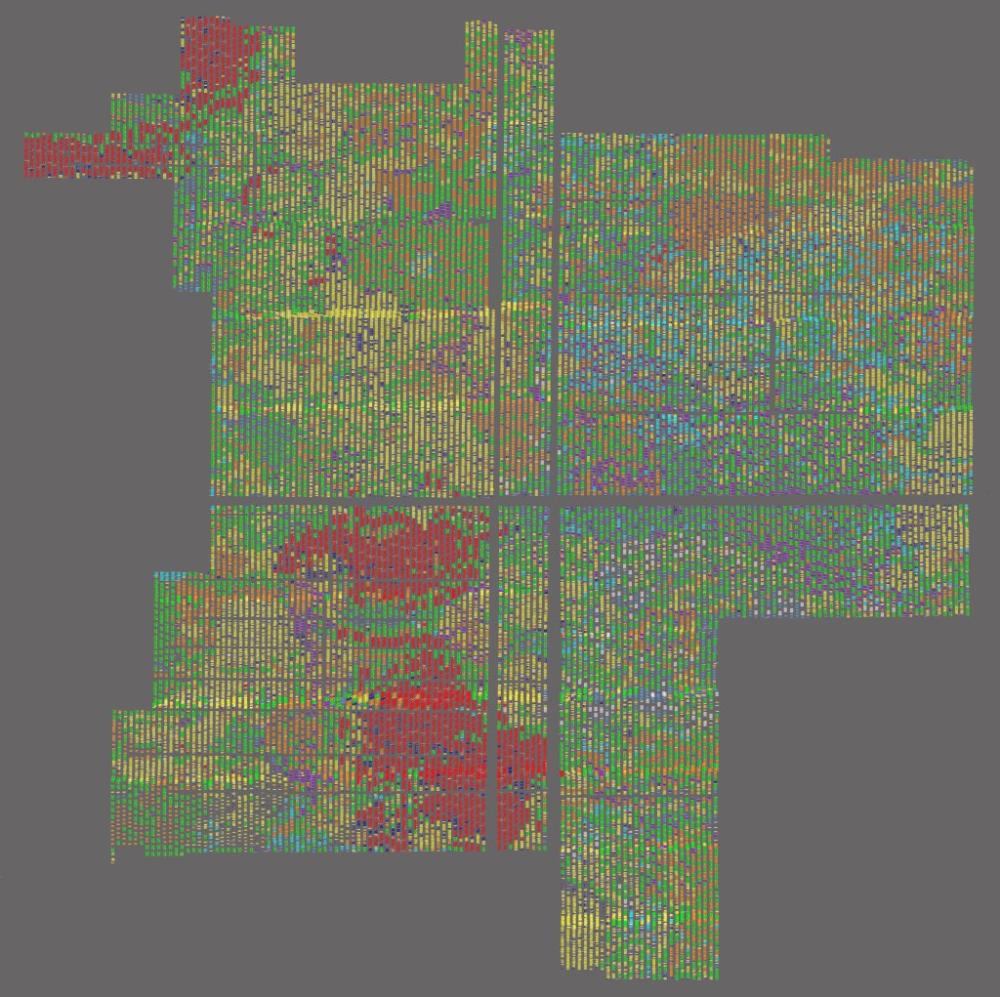

# PSX CPU Cells

This folder contains all research about psxcpu standard cells library.

Goals:
- Identify all cells
- Get sequenced cells map in xml/other convenient format

Cells in its glory:

## active_sequenced

Workspaces (\*.wrk) for Patterns tool to identify cells over polysilicon images (images are here: https://drive.google.com/drive/u/1/folders/1ytoTS_vl4F2xwJpaPSVvHei9QjYtd-Dr).

See notes.txt about current progress and some info.
